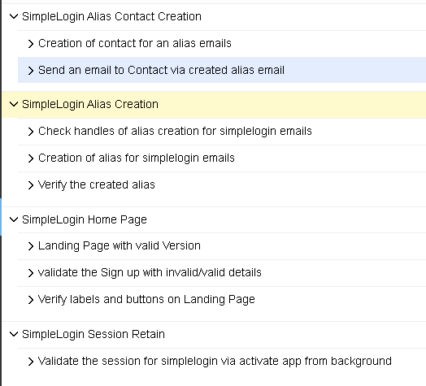

# Mobile_App_Testing_With_Appium(Android/iOS)

A **Pytest-based automation framework** built using the **Page Object Model (POM)** with **Appium, Python, and Allure reporting** has been developed to test the **SimpleLogin mobile application for Mobile platforms(Android/iOS)**.

The framework is structured around **POM and Pytest fixtures**, enabling clear separation of responsibilities and better test organization. It supports multiple categories of testing, including **End-to-End (E2E), Functional, Compatibility, and Reliability testing** within a unified framework.

Designed with **scalability and extensibility** in mind, the framework allows additional test types to be integrated easily. By separating components such as **test logic, page objects, and test data**, it improves **maintainability, reusability, and overall test management**, making it easier to scale as the application evolves.


### Automated Testing Framework Design

1. **Hybrid Framework:**
   The framework follows a **hybrid approach**, combining the strengths of **data-driven and keyword-driven testing** to provide greater **flexibility, reusability, and maintainability**.

2. **Modular and Layered Architecture:**
   The framework is designed with a **decoupled, layered architecture**, ensuring that modifications in one layer (such as page objects or locators) do not impact other layers directly.

   * **Layer 1 – Test Data Layer:**
     Maintains test data sources such as **JSON files, Excel sheets, or other external data repositories**.

   * **Layer 2 – Page Object Layer:**
     Contains **page classes** that encapsulate **UI elements (locators)** and the **methods required to interact with those elements**.

   * **Layer 3 – Test Logic Layer:**
     Implements **test scenarios and actions**, invoking methods from the **page object classes** to perform application interactions.

   * **Layer 4 – Test Runner Layer:**
     Acts as the **entry point for test execution**, responsible for **initialization, configuration, setup, teardown, and execution management**.

   * **Layer 5 – Test Report Layer:**
     Responsible for generating **comprehensive test execution reports** that provide insights into test results, failures, and overall execution metrics.

3. **Test Execution Flow:**
   Test execution is orchestrated using a **test runner framework such as Pytest, Nose, JUnit, or TestNG**, which manages **test discovery, execution, reporting, and lifecycle hooks**.


### Test Architecture and Tools

1. **Tool & Language:** Appium with Python using Selenium bindings for mobile automation.  
2. **Design Pattern:** Page Object Model (POM) to ensure better code organization, reusability, and maintainability.  
3. **Testing Framework (Hybrid):** Implements a hybrid approach by combining **data-driven** and **keyword-driven** testing methodologies.  
4. **Continuous Integration:** Can be integrated with CI/CD tools such as **Jenkins** or **GitHub Actions** for automated test execution.


### Why Use Appium with Python Bindings?

1. **Cross-Platform Mobile Automation:**
   Appium allows automation testing for **both Android and iOS applications** using a single unified framework.

2. **Multi-Language Support:**
   Through the **WebDriver protocol**, Appium supports multiple programming languages, providing flexibility in choosing the preferred development language.

3. **WebDriver-Based Architecture:**
   Appium operates on the **WebDriver protocol**, and **Selenium’s Python bindings implement this protocol**, enabling Python scripts to control mobile applications in a similar way that Selenium automates web browsers.

4. **Stable and Reusable Automation Design:**
   The combination of **Python, Appium, and Selenium bindings** provides stable WebDriver APIs, improved compatibility, and supports reusable automation patterns such as **Page Object Model (POM), explicit waits, and structured locator strategies**.

5. **Efficient and Scalable Automation:**
   This stack enables **cross-platform mobile automation** using familiar **Selenium-style commands**, while benefiting from **Python’s simplicity, readability, and extensive testing ecosystem**.


### Framework Structure

```
├── app/            # Application binaries (*.apk, *.ipa)
├── pages/          # Page Object Model (POM) implementation
│   ├── locators/   # Repository of UI locators for application elements
│   ├── ui/         # Page classes encapsulating UI elements
│   ├── action/     # Methods and classes that perform actions on UI elements
├── data/           # Test data sources (e.g., JSON, Excel, etc.)
├── log/            # Generated execution logs
├── reports/        # Test execution reports and artifacts
├── utils/          # Utility modules (helpers, logger, common functions)
├── tests/          # Test cases / test runner files that trigger test execution
│
├── config.ini      # Environment, device, and Appium server configuration
├── pytest.ini      # Pytest configuration and markers
├── README.md       # Project documentation and usage instructions
└── requirements.txt # Project dependencies for installation
```

## Task Description

1. Download the **SimpleLogin mobile application** for both platforms:

   * **Android** (`.apk`)
   * **iOS** (`.ipa`)

2. Create automated **test scenarios (features and stories)** for the SimpleLogin application.



3. Build a **Pytest-based mobile automation framework** following the **Page Object Model (POM) design pattern** using the following technology stack:

* **Appium**
* **Python**
* **Pytest**
* **Allure Reporting**

4. Detailed instructions for **prerequisites, environment setup, and test execution** are provided below.

---

## Prerequisites and Setup Instructions

1. Install **Python 3.11 or higher**
   [https://www.python.org/downloads/](https://www.python.org/downloads/)

2. Clone the repository to your local machine:

```bash
git clone https://github.com/saafihub/mobile_simple_app.git
cd mobile_simple_app
```

3. **Project Setup Steps**

* Install virtual environment tool:

```bash
pip install virtualenv
```

* Create a virtual environment:

```bash
python -m venv mobile_tests
```

* Activate the virtual environment:

```bash
mobile_tests\Scripts\activate
```

* Return to the project root folder:

```bash
cd mobile_simple_app
```

* Install the required dependencies:

```bash
pip install -r requirements.txt
```

---

## Android Setup (Emulator / Real Device / Bluestacks)

1. Install **Appium Server**
    [Install Node.js and Appium v1.22.3 via npm install -g appium@1.22.3]
  

3. Install **Android Studio and Android SDK**
   [https://developer.android.com/studio/install](https://developer.android.com/studio/install)

4. Create an **Android emulator** using Device Manager, or connect a **real device**, or use **Bluestacks**.

5. Verify connected devices:

```bash
adb devices
```

Copy the **device name** for configuration.

5. Start the **Appium server**

```bash
appium
```

---

## iOS Setup (macOS Required)

> **Note:** iOS testing is **not currently included in the test suite** due to the unavailability of macOS. The steps below are provided for reference to enable iOS automation in the future.

1. Install **Appium Server**
   [Install Node.js and Appium v1.22.3 via npm install -g appium@1.22.3]

2. Install **Xcode** from the App Store to use the **iOS simulator** or connect a **real device**.

3. Install **Carthage** and configure **WebDriverAgent**.

4. Configure **Provisioning Profile / Signing** for the `WebDriverAgentRunner` target in Xcode.

5. Start the **Appium server**.

---

## Running Tests Locally

*(Emulator / Real Device / Bluestacks)*

1. Verify the **device configuration** in `config.ini`.

If the device name does not match `CURRENT_DEVICE`, update the value accordingly.

2. Run **Android tests**

```bash
pytest tests/test_android.py --runmode=local --alluredir=reports/allure-results
```

or

```bash
pytest tests/test_android.py --runmode=local --html-report=./report/pytest_html_report.html
```

3. Run **iOS tests**

```bash
pytest tests/test_ios.py --runmode=local --alluredir=reports/allure-results
```

or

```bash
pytest tests/test_ios.py --runmode=local --html-report=./report/pytest_html_report.html
```

---

## Running Tests on BrowserStack

1. Verify **BrowserStack configuration** in `config.ini`.

Ensure `BROWSERSTACK_DEVICES`, credentials, and app details are correctly configured.

*(The framework can also be extended to other device farms such as Sauce Labs.)*

2. Run **Android tests**

```bash
pytest tests/test_android.py --runmode=browserstack --alluredir=reports/allure-results
```

3. Run **iOS tests**

```bash
pytest tests/test_ios.py --runmode=browserstack --alluredir=reports/allure-results
```

---

## Running Tests in Parallel

### Local Execution

```bash
pytest tests/test_android.py -n 2 --runmode=local --alluredir=reports/allure-results
```

### BrowserStack Execution

```bash
pytest tests/test_android.py -n 2 --runmode=browserstack --alluredir=reports/allure-results
```

---

## Re-running Failed Tests

### Local Execution

```bash
pytest tests/test_android.py --reruns 2 --reruns-delay 2 --runmode=local --alluredir=reports/allure-results
```

### BrowserStack Execution

```bash
pytest tests/test_android.py --reruns 2 --reruns-delay 2 --runmode=browserstack --alluredir=reports/allure-results
```

---

## Running Tests with Tags (Smoke / Regression)

### Local Execution

```bash
pytest tests/test_android.py -m smoke --runmode=local
```

or

```bash
pytest tests/test_android.py -m regression --runmode=local
```

### BrowserStack Execution

```bash
pytest tests/test_android.py -m smoke --runmode=browserstack
```

---

## Report Formats

### Pytest HTML Report

```bash
pytest test_*.py --html-report=./report/pytest_html_report.html
```

### Allure Report

Run tests with:

```bash
pytest test_*.py --alluredir=reports/allure-results
```

Generate the report:

```bash
allure generate reports/allure-results -o reports/allure-report --clean
```

Open the report:

```bash
allure open reports/allure-report
```


